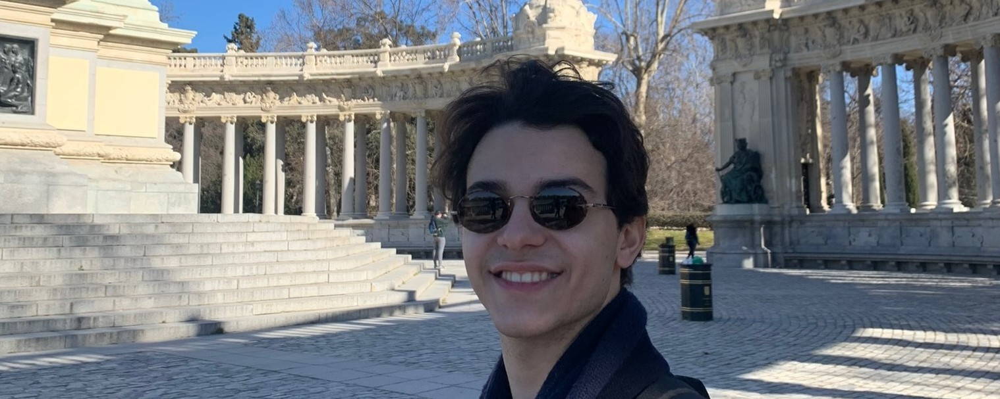

👋 Hi! I'm Gonçalo - 22 and currently studying Aerospace Engineering at TU Delft. I'm passionate about space, engineering, computers, and anything tech, really. In my free time, I like to work on [[index#Projects|projects]], take [[pics|pictures]] and [[reading|read]].

Always learning.

Feel free to [reach out to me](https://www.linkedin.com/in/gonespral/) if you'd like to discuss any of my projects or collaborate!

<!-- 

  

 -->

<!--  -->

<!--  -->

## Projects

Over the years I've worked on a variety of projects, ranging in fields from aerospace engineering to computer science. Here are some of my favorites:

### [[wavewings|WaveWings]]
Detailed design concept for an integrated airborne wind and wave energy converter, set up as a 400-unit renewable energy farm. Set up to contribute to the European Union's 2050 net-zero goals. By harnessing both wind and wave energy, the projects aims to make a significant contribution to the clean energy transition and reduce reliance on fossil fuels. Carried out as part of the Design Synthesis Exercise at TU Delft.

### [[rebo|Project REBO]] 
A robotic solution to combat drinking can littering and promote recycling by collecting, crushing, and storing aluminum beverage cans while returning the Statiegeld to customers, created as part of the Robotics Minor at TU Delft.

### [[chatbot|Teaching a Chatbot Domain Knowledge]]
Creating a GPT-3 powered chatbot that can be taught domain-specific knowledge using vector embeddings and straightforward RAG techniques. The chatbot can be used to answer questions about a specific topic, such as a university course, by providing relevant information from a knowledge base.

### [[rocketry|Rocketry]]
Overview of my work at DARE, the student rocketry team at TU Delft. I've worked on various projects, including the Stratos V rocket, the NEAR team and Project Dodo.

### [[neuroevolution|Neuroevolution from Scratch]]
Developed a neuroevolution algorithm from scratch to optimize neural networks, with the goal of exploring modern technologies and documenting my research. 

### [[hacking-cars|Hacking Cars]]
Developed a method to exploit security systems used in wireless car keys, with the goal of raising awareness about personal cybersecurity. 

### [[radio-telescope|Tiny Radio Telescope]]
Built a small radio telescope to observe the geostationary satellites in the sky, with the goal of learning more about radio astronomy and signal processing. Future developments of the project include the construction of a larger telescope, capable of observing the 21cm hydrogen line.

